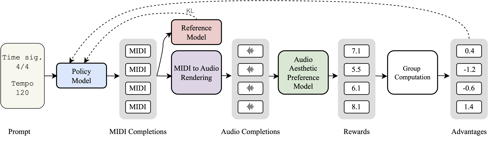

# SMART: Tuning a symbolic music generation system with an audio domain aesthetic reward




This repository contains the implementation for our paper on using aesthetic ratings to finetune symbolic music generation systems with reinforcement learning.

## Abstract

Recent work has proposed training machine learning models to predict aesthetic ratings for music audio. Our work explores whether such models can be used to finetune a symbolic music generation system with reinforcement learning, and what effect this has on the system outputs.
To test this, we use group relative policy optimization to finetune a piano MIDI model with Meta Audiobox Aesthetics ratings of audio-rendered outputs as the reward. We find that this optimization affects multiple low-level features of the generated outputs, and improves the average subjective ratings in a preliminary listening study with 14 participants. We also find that over-optimization dramatically reduces diversity of model outputs.


**Listening examples**: [https://erl-j.github.io/SMART-demo/](https://erl-j.github.io/SMART-demo/)

## Setup

1. Install dependencies:
```bash
pip install -r requirements.txt
```

2. Run the training:
```bash
python smart.py
```

The main training parameters can be adjusted in `smart.py`:

- `NUM_TRAIN_STEPS`: Number of training iterations (default: 200)
- `LEARNING_RATE`: Learning rate for optimization (default: 1e-4)
- `BETA`: KL divergence penalty coefficient (default: 0.04)
- `TEMPERATURE`: Sampling temperature for generation (default: 1.0)
- `NUM_GENERATIONS`: Number of samples per prompt (default: 8)

## Adding New Rewards

The reward system is modular and allows easy addition of new reward functions. To add a new reward:

1. **Create a new reward processor** in `processors.py`:

```python
class MyRewardProcessor(Processor):
    def __call__(self, records):
        for record in records:
            # Calculate your reward for each record
            score = self.compute_rewards(record)
            # normalized reward should be between 0 and 1.
            record["normalized_rewards"]["MY_REWARD"] = score
        return records
```

2. **Add to the reward pipeline** in `smart.py`:

```python
reward_manager = RewardManager(
    processors = [
        MidiTokToSymusicProcessor(tokenizer, is_multitrack=False, max_beats=100),
        TinySoundfontSynthProcessor(SF_PATH, SAMPLE_RATE) 
        # other rewards here...,
        MyRewardProcessor(),  # Add your processor here
    ],
    reward_weights = {
        "MY_REWARD": 0.5,  # Add weight for your reward
    },
    output_dir=OUTPUT_DIR
)
```

## Output

Training artifacts are saved to `artefacts/runs/` with:
- Model checkpoints
- Generated audio samples
- Training logs and metrics

## Citation

If you use this code in your research, please cite our paper:

```bibtex
@inproceedings{smart2025,
  title={SMART: Tuning a symbolic music generation system
with an audio domain aesthetic reward},
  author={Nicolas Jonason and Luca Casini and Bob L. T. Sturm},
  booktitle={Proceedings of the 6th Conference on AI Music Creativity (AIMC 2025), Brussels, Belgium, September 10th-12th},
  year={2025}
}
```